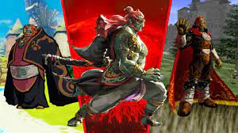
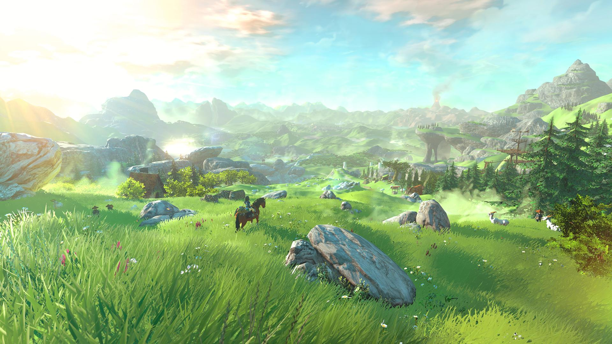

# PRIVATE - DO NOT READ

## That means you, Link and Zelda!

## Property of this cool guy:

### Rhinoc, December, 18, 10.495

It's almost the Rhinoc Solstace. How fitting. It seems fate is determined to mock me in my darkest hour.

I went through the trouble of breaking the sword that seals the darkness, but it appears that the princess time traveled and turned into a dragon or something and now that green eyesore is bandying it about, stealing all my carefully guarded treasures.

Just look at this cocky little jerk:

I busted up the serene landscape he seemed to enjoy crawling around in so much, hoping it would really bum him out.

This is what the place use to look like before my renovations:

I've since learned that he's just been building weird contraptions and skydiving to get around now. Doesn't even seem to mind.

Life is so unfair!